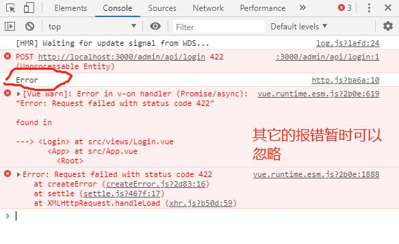
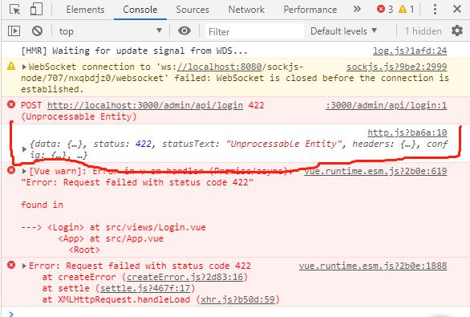
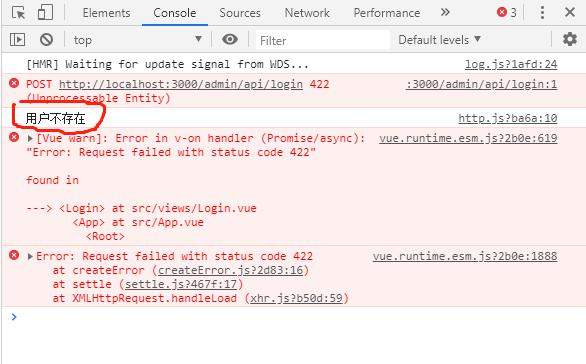
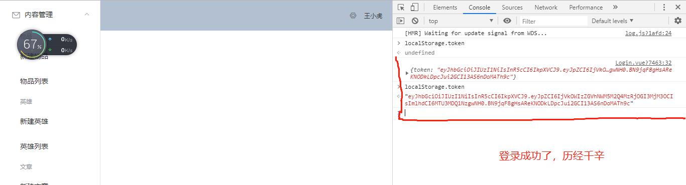
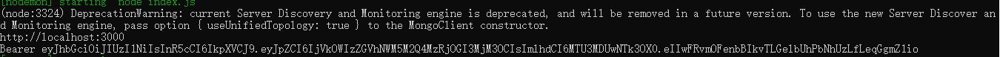
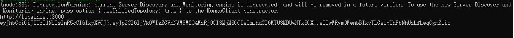
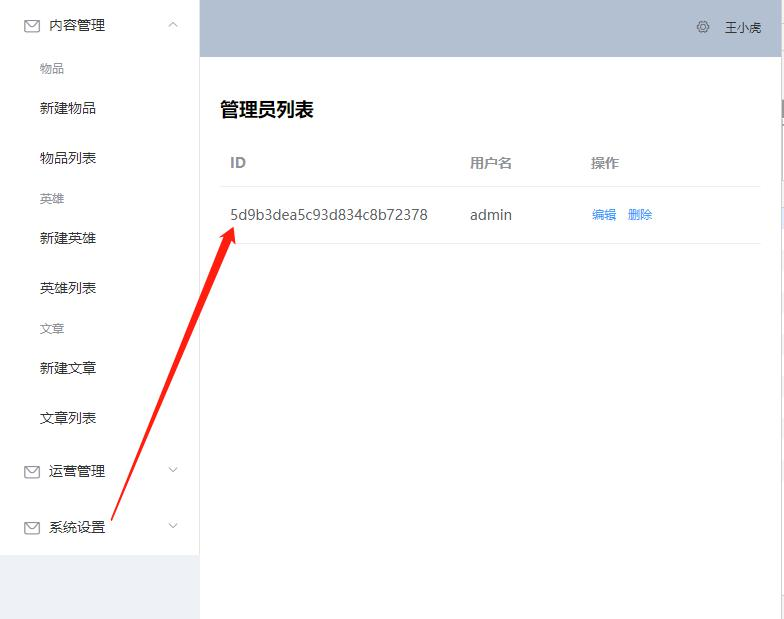
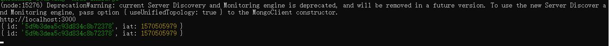
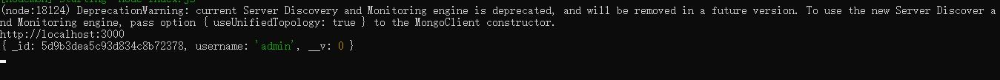
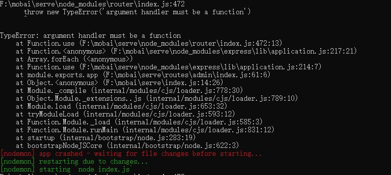

## 本次主要完成了图片框的显示

## 管理员账号管理：密码使用了 bcrypt
## 在server文件下安装命令：npm install bcrypt
## 编写日期：2019年10月7日

## 在做登录接口的时候，对于用户名不存在的需要在全局做一个捕获
## 在'admin/views/http.js'文件夹添加一个全局捕获的代码，主要是捕获用户名是否存在
## 相关文档的资料在'www.npmjs.com',查找axios 中的Interceptors

## console.log(err.name) ->截图如下


## console.log(err.response) =>错误对象上面有一个返回对象


## console.log(err.response.data) =>返回报错的响应数据，能够更加的具体知道错误是什么
## console.log(err.response.data.message) =>返回报错的具体对象



## 引入 'Vue'，
##  Vue.prototype.$message 此代码段的作用是：如果某个用户名不存在的话，就用弹框显示
##
##  如果用户名和密码都没问题，返回taken，需要安装'npm install jsonwebtoken'
##  singn(payload: string | object | Buffer, secretOrPrivatekey: Secret,options?: SignOPtions):string
##  secretOrPrivatekey 这个密钥很重要，用户在生成'token'的时候，就给它一个密钥，然后再去根据这个算法去生成一个'token'，生成完之后客户端
##  可以不需要密钥就给它解出来
##  但是要验证是否篡改过，就需要使用另外一种方法：jwt.sign()

## 尝试添加一个效果，在登录成功之后，根据账户来设置，弹出'欢迎您再次回归',res.send()可以实现(admin->index.js)



## 错题(坑): 之前一直再改'登录'的问题(密码有误一直显示不出来),后来突然发现是自己掉进自己设的坑里面去了
## 原来登录的账号和密码是要和管理员页面设置的账号和密码一致,当时就是没有意识到,所以浪费了好几个小时
## 还好,问题找到,加油,虽然是看着教学视频学习的,但是也得努力向前看

### 日期：2019-10-08-11 11：30
### 此次的任务要求：服务端的登录校验

## 没有 token 就不允许访问

# 服务端登录校验
## 添加一个拦截器（server/routes/admin/index.js）
```
// Add a request interceptor
axios.interceptors.request.use(function (config) {
    // Do something before request is sent
    return config;
  }, function (error) {
    // Do something with request error
    return Promise.reject(error);
  });
```

## Berar 就是行业内的一个规范

## const token = req.headers.authorization


## const token = String(req.headers.authorization || '').split(' ').pop()


```
const tokenData = jwt.verify(token, app.get('secret'))
		// console.log(token)
		console.log(tokenData)

```

dos命令输出的那个 ID 和 iat 就是 上图中管理员的账号
我们可以通过用户的ID 来删除token，也可以使用token来解析ID


```
router.get('/',async (req, res, next) => {
		// 此操作用于校验用户是否登录
		// 第一步，获取用户的信息
		// const token = req.headers.authorization
		const token = String(req.headers.authorization || '').split(' ').pop()
		// const tokenData = jwt.verify(token, app.get('secret'))
		const { id } = jwt.verify(token, app.get('secret'))
		<!-- 服务端请求的时候，知道用户端是谁 -->
		req.user = await AdminUser.findById(id)
		console.log(req.user)
		// console.log(token)
		// console.log(tokenData)
		await next()
```



### 2019-10-10
### 服务端登录校验
### 一个特别重要的事情：再做后台的时候，需要使用 AdminUser 来判断是否登录，但是
### 在做前端的时候，如果也使用到了此AdminUser，就需要换一个模型，就不和AdminUser同名，可以换另外一个名字，例如User

## 报错问题描述：在服务器内的报错

## 后查找发现，我在 middleware/resource.js 中的 async 前面没有加 return 返回

## 客户端登录限制（beforeEach,meta）（功能是前端的）
### 使用到了导航守卫的知识点，全局守卫

## 上传文件的登录校验
## 在之前做客户端登录限制的时候，由于没有考虑到文件的上传功能，导致图片上传不了，在图片框内也显示不了（状态码：401）
## admin/src/main.js 中加一个方法 `mixin`:Vue mixin 定义，全局都可以使用到
## 上传文件，使用计算属性 `computed`,里面定义一个 `uploadUrl`方法
## 在ItemEdit.vue的`<el-upload>`内添加`：action="uploadUrl"`

### BUG问题遗留（2019-10-10 21：30还未解决）
### 在新建英雄列表项中，上传文件失败，401状态码2019-10-10 21：30 已得到解决）
### 解决方法：```
	### <el-upload class="avatar-uploader"
	### :action="uploadUrl"
	### :headers="getAuthHeaders()"
	### :show-file-list="false"
### ```
### 连续点击同一个页面多次会报错


### 新闻资讯-数据录入，加上后台的bug修复
### 先上个插件：`npm install require-all`
### 主要用途：把某一文件夹的所有文件都引用进来

### 后台问题：从编辑页面直接点击到新建页面，没有任何的变化，因为在默认情况下，有一个<router-view>，它默认是是用组件来区分的，但是，这里有两个地方使用了，要解决这个问题可以使用路由的路径来区分开
<router-view:key="$route.path">

### 将数据传到后台，可以使用`http://localhost:3000/web/api/news/init`查看

### 获取王者荣耀新闻信息

### 王者荣耀英雄列表，界面展示
### 遇到的一些问题，获取不到新闻列表的数据，长时间的检查和他人的协作下发现是一个单词少了一个字母：s

### 英雄关系的头像需要显示出来的话，就要（在Hero.js）关联到 partners 里的 hero，partners 并不是直接关联英雄人物头像的

### plain 的作用：可以是界面的 ... 继续存在，让详情页面的 ... 去掉


